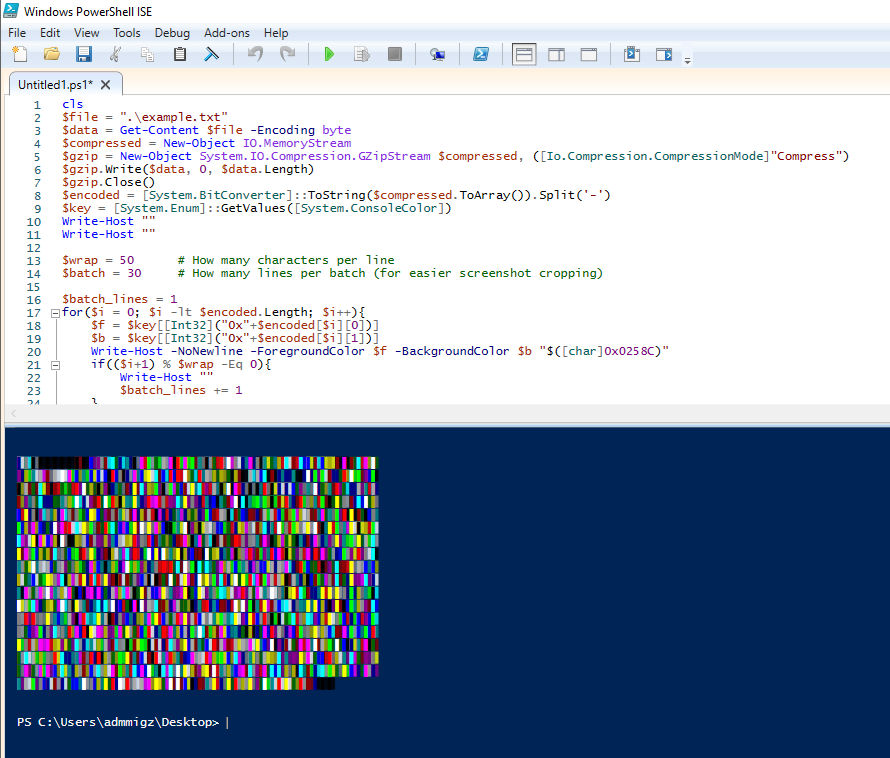
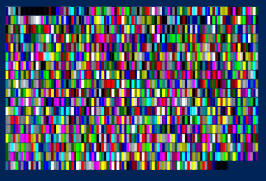

# PRISM (WIP)
## Quick Steps
1) Use `prism.ps1` on the target machine to convert a file to a grid of colored squares.
2) Screenshot the batches of squares.
    1) Stitch the screenshots into a single image with no gap between the batches.
4) Run the `prism.py` on your local machine to convert the image back into a file.

## About
Picture this scenario:

*You have access to a Windows VM through a web console and there is a small file you wish to copy from the VM, however the VM itself doesn't have network access, and there is no clipboard interaction between your host and the VM, so no copy pasta :(.
Your attempts to use OCR on screenshots of the file also fail (even hexdumps of binary files).*

*So how do you get the file?*

I went with converting the file to an image :)

By typing a relatively short script on the VM (`prism.ps1`), I could convert a relatively small file ( < 25KB compressed) into a series of colored blocks.
After capturing the output via screenshots and cropping + stitching the batches of blocks together, I wrote a script (`prism.py`) to parse the image and convert it back into the original file.

## Examples
Running the `prism.ps1` script on the target machine while specifying the file gives output like below:

The cropped screenshot can then be saved and used (`example.png` in this case)

To reverse the process, run `./prism.py example.png` on the local machine:

Enjoy your ascii cat art!

## Issues
* It may not correctly frame the blocks properly and fail.
  * *Make sure the colored blocks are only surrounded by the background color. Stray pixels prevent it from framing properly.*

* There may be too many contentions (blocks that may be incorrectly identified), or the contentions are too high.
  * *Try modifying the `$wrap` and `$batch` values to make the output image more square.*
  * *You can also use PowerShell ISE's scale slider in the bottom right corner to scale the output up and reduce contentions*

* Converting a file to an image takes forever.
  * *I'm still trying to work this one out. For some reason it **EATS** memory and hogs the CPU. I'm no PowerShell expert, so it's probably something easy to fix, but I'll be working on that next.*
 
## Todo
### Find a better way to produce the image
For some reason this small PowerShell script consumes rediculous amounts of memory and processor time. Worse yet, it doesn't release this memory once the image has been produced (probably because it's using `Write-Host`).

It was intended to be small since it would be used in cases where file uploads and clipboard interaction are not possible, so you would have to type the script out manually. However a friend suggested autotyping from the local machine might make that a moot point, so there could be more complex but more efficient ways to do it.

### Include auto-stitching
Rather than taking the multiple screenshots and manually stitching them into a single image in an image editor (mspaint? lol), I'm considering the idea of allowing multiple image files to be included during the parsing process, and having it stitch the images together itself.

## Let me know if you have any other good ideas
Thanks :)
